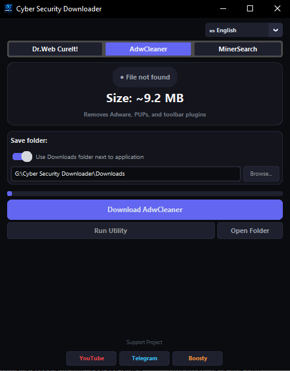

# 🛡️ Cyber Security Downloader

[🇬🇧 English](README.en.md) · [🇷🇺 Русский](README.md)

**Cyber Security Downloader** is a portable Windows utility that allows you to quickly download and launch popular security tools from one convenient interface.

The application combines several utilities in one program and automatically checks for existing local files and available newer versions on the server.

Supported utilities:

* **Dr.Web CureIt!** - standalone antivirus scanner;
* **AdwCleaner** - removes Adware, PUPs, and unwanted browser components;
* **MinerSearch** - detects and removes hidden cryptocurrency miners.

The application does not require installation and can be used as a portable application.

> ⚠️ Cyber Security Downloader is not an antivirus. It is designed to download and launch third-party security tools.

---

## 🌟 Features

### 🦠 Multiple Utilities in One Application

Cyber Security Downloader allows you to switch between supported tools directly from the interface.

Available utilities:

* Dr.Web CureIt!;
* AdwCleaner;
* MinerSearch.

The list of supported utilities may be expanded in future versions.

### 🔄 Version Checking

When started, the application checks for the local file and attempts to retrieve information about the current file from the server.

If a newer version is available, the interface displays the corresponding status.

For example:

```text
● Latest version is installed
```

or:

```text
● NEW VERSION AVAILABLE!
```

### 📊 File Size Comparison

The application retrieves the remote file size and compares it with the local version.

The interface displays:

* local file size;
* available version size;
* current download amount;
* total file size.

### ⚡ Download Monitoring

During the download, the application displays:

* progress;
* download speed;
* downloaded amount;
* total file size;
* estimated remaining time.

Example:

```text
125.4 MB / 180.2 MB
4.82 MB/s • ~11 sec remaining
```

### 🔐 Downloaded File Validation

The file is initially saved as a temporary `.tmp` file.

After the download is completed, the application performs basic validation.

For `.exe` files, the Windows PE header is checked:

```text
MZ
```

If the downloaded file is not a valid Windows executable, it will not be saved as the final file.

### #️⃣ SHA-256

After downloading, the application calculates the SHA-256 hash of the file.

The hash is displayed in the application console and can be used for additional file verification.

### ❌ Cancel Downloads

The download can be cancelled directly from the interface.

When cancelled, the temporary file is removed so that an incomplete download is not left in the destination folder.

### ▶️ Quick Launch

After a successful download, the utility can be launched directly from Cyber Security Downloader.

If the file already exists in the selected folder, the application automatically detects it.

### 📁 Download Folder Selection

By default, downloaded files are stored in:

```text
Downloads
```

The folder is created next to the application.

You can also disable the default directory and select a custom location for downloaded files.

### 🔊 Sound Notification

After a successful download, the application plays a notification sound.

A custom sound can be provided as:

```text
alert.wav
```

If the file is not available, Windows may use the default system notification sound.

### 💾 Settings Storage

Application settings are stored in:

```text
settings.json
```

The following settings are saved:

* selected utility;
* interface language;
* download directory.

### 🌍 Multi-Language Interface

The application supports:

* 🇷🇺 Russian;
* 🇺🇸 English;
* 🇪🇸 Spanish;
* 🇩🇪 German;
* 🇫🇷 French;
* 🇨🇳 Chinese;
* 🇵🇹 Portuguese;
* 🇯🇵 Japanese.

---

## 🖼️ Screenshot



---

## 💻 System Requirements

* Windows 10;
* Windows 11;
* Python 3.x - when running from source;
* Internet connection.

The ready-to-use portable `.exe` version does not require Python to be installed.

---

## 📂 Project Structure

```text
Cyber-Security-Downloader/
│
├── Cyber Security Downloader.py
├── requirements.txt
├── README.md
├── README.en.md
├── LICENSE
├── icon.ico
├── alert.wav
│
└── assets/
    └── screenshot.png
```

### File Description

| File                           | Description            |
| ------------------------------ | ---------------------- |
| `Cyber Security Downloader.py` | Main application file  |
| `requirements.txt`             | Python dependencies    |
| `README.md`                    | Russian documentation  |
| `README.en.md`                 | English documentation  |
| `LICENSE`                      | Project license        |
| `icon.ico`                     | Application icon       |
| `alert.wav`                    | Notification sound     |
| `assets/screenshot.png`        | Application screenshot |

---

## 🚀 Installation and Launch

### 1. Download the Project

Clone the repository:

```bash
git clone https://github.com/cybercraftt/Cyber-Security-Downloader.git
```

Navigate to the project directory:

```bash
cd Cyber-Security-Downloader
```

Or download the project archive using:

```text
Code → Download ZIP
```

Extract the archive to a convenient location.

---

### 2. Install Dependencies

Install CustomTkinter:

```bash
pip install customtkinter
```

If Pillow is required:

```bash
pip install pillow
```

Or:

```bash
python -m pip install customtkinter pillow
```

---

### 3. Run the Application

```bash
python "Cyber Security Downloader.py"
```

The Cyber Security Downloader graphical interface will open.

---

## 📦 Dependencies

Main components:

```text
customtkinter
```

The application also uses the following standard Python modules:

```text
os
sys
time
datetime
threading
ssl
urllib
hashlib
json
re
subprocess
zipfile
webbrowser
```

### Main Module Purposes

| Module          | Purpose                        |
| --------------- | ------------------------------ |
| `customtkinter` | Graphical user interface       |
| `urllib`        | HTTPS file downloads           |
| `threading`     | Background download operations |
| `hashlib`       | SHA-256 calculation            |
| `zipfile`       | ZIP archive handling           |
| `json`          | Settings storage               |
| `ssl`           | Secure HTTPS connections       |
| `webbrowser`    | Opening external links         |

---

## 🛠️ Building an EXE

You can use PyInstaller to create a portable `.exe` application.

Install PyInstaller:

```bash
pip install pyinstaller
```

Then run:

```bash
pyinstaller --onefile --noconsole "Cyber Security Downloader.py"
```

The resulting file will be placed in:

```text
dist/
```

### Building with an Icon

If `icon.ico` is available:

```bash
pyinstaller --onefile --noconsole --icon=icon.ico "Cyber Security Downloader.py"
```

### Including Additional Files

If the application needs to use `alert.wav` or other external resources, they must be included in the PyInstaller build using the appropriate `--add-data` option.

---

## ⚙️ How to Use

### Step 1. Launch the Application

Run the Python file or the compiled `.exe`.

### Step 2. Select a Utility

Select the required security tool from the top of the application:

```text
Dr.Web CureIt! | AdwCleaner | MinerSearch
```

### Step 3. Check the Status

The application automatically checks whether a local file exists.

If the file is already present, its date and size will be displayed.

The application then checks the server and determines whether a newer version is available.

### Step 4. Select a Folder

By default, the application uses:

```text
Downloads
```

To choose another folder, disable the default directory option and click:

```text
Browse...
```

### Step 5. Start the Download

Click the download button.

The application will begin downloading the file and display:

```text
Progress
Speed
File size
Remaining time
```

### Step 6. Wait for Validation

After the download is completed, the application validates the downloaded file.

For `.exe` files, the following header is checked:

```text
MZ
```

The SHA-256 hash is also calculated.

### Step 7. Launch the Utility

After a successful download, the following button becomes available:

```text
Launch Utility
```

---

## 🧠 How It Works

Simplified workflow:

```text
Launch application
        │
        ▼
Select utility
        │
        ▼
Check local file
        │
        ▼
Check server
        │
        ▼
Update available?
   ┌────┴────┐
   │         │
  No        Yes
   │         │
   │         ▼
   │    Start download
   │         │
   └────┐    ▼
        │ Validate file
        │         │
        │         ▼
        │      SHA-256
        │         │
        │         ▼
        └──► Save file
                  │
                  ▼
            Launch utility
```

---

## 🔐 Download Security

Cyber Security Downloader uses HTTPS connections when downloading files.

Files are initially downloaded to a temporary file:

```text
filename.exe.tmp
```

After the download is completed, the application validates the received data.

For executable files, the following header is checked:

```text
MZ
```

This can help detect situations where a server returns an HTML error page or another invalid file instead of an executable.

After successful validation, the temporary file is renamed to its final filename.

> ⚠️ Checking the `MZ` header and calculating SHA-256 do not constitute a complete security or antivirus scan. Users are responsible for verifying downloaded files and their sources.

---

## 🔒 Download Sources

The application contains links to pages and servers provided by the respective developers.

Current supported tools include:

* **Dr.Web CureIt!**
* **Malwarebytes AdwCleaner**
* **MinerSearch**

Always use trusted and official sources and verify download URLs when preparing new releases.

---

## ⚠️ Windows SmartScreen

The portable `.exe` version may trigger a Windows SmartScreen warning.

This can happen when the application is built with PyInstaller and does not have a digital signature from a verified publisher.

In this situation, it is recommended to:

1. Download the project from the official GitHub repository.
2. Review the source code.
3. Build the application yourself if necessary.
4. Scan the resulting `.exe` using Windows Security or another trusted security solution.

---

## ❗ Troubleshooting

### `ModuleNotFoundError: No module named 'customtkinter'`

Install the required library:

```bash
pip install customtkinter
```

---

### `pip` is not recognized

Try:

```bash
python -m pip install customtkinter
```

---

### `python` is not recognized

Check that Python is installed and that Python has been added to the system `PATH`.

After installation, restart the command prompt.

---

### File Download Fails

Possible causes include:

* no Internet connection;
* unavailable server;
* changed URL by the developer;
* blocked connection;
* SSL error;
* temporary server problems.

Check whether the official website of the corresponding utility is accessible.

---

## 🧪 Downloaded File Verification

The application calculates the SHA-256 hash after the download is completed.

Example:

```text
[Dr.Web CureIt!] SHA-256:
xxxxxxxxxxxxxxxxxxxxxxxxxxxxxxxxxxxxxxxxxxxxxxxxxxxxxxxxxxxxxxxx
```

The resulting hash can be compared with a checksum provided by the developer, if such information is available.

---

## 🛡️ Limitations

Cyber Security Downloader does not perform a full antivirus scan of downloaded files.

The application checks:

* download integrity;
* minimum file size;
* Windows `MZ` header for `.exe` files;
* SHA-256 hash of downloaded data.

These checks do not guarantee that a file is free from malicious content.

---

## 📜 License

This project is released under the **MIT License**.

See the:

```text
LICENSE
```

file for details.

---

## 🧡 Support the Project

If Cyber Security Downloader is useful to you, you can support the development of the project.

**Boosty:**

https://boosty.to/cyber_craft

Support is completely voluntary and helps with the development of new small utilities and improvements to existing projects.

---

## 🌐 Cyber Craft

Follow the project and discover new tools:

* 📺 **YouTube** - https://www.youtube.com/channel/UCcGfKjP4XdfkLokNgVOIAyA
* 💬 **Telegram** - https://t.me/CyberCraftLab
* 🧡 **Boosty** - https://boosty.to/cyber_craft

---

## ⭐ Support the Project

If you find the project useful:

* ⭐ Star the repository;
* report bugs through **Issues**;
* suggest improvements;
* share the project with others.

---

<p align="center">

**Made with 🖤 by Cyber Craft**

</p>
