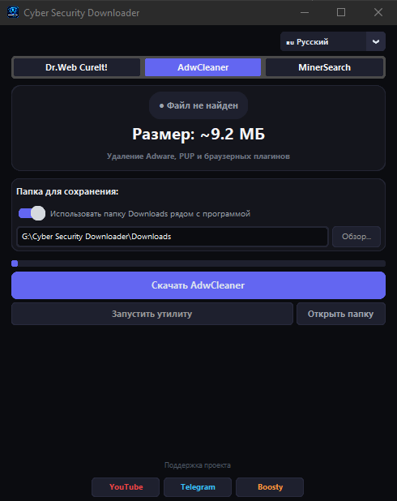

# 🛡️ Cyber Security Downloader

[🇬🇧 English](README.en.md) · [🇷🇺 Русский](README.md)

**Cyber Security Downloader** — портативная утилита для Windows, которая позволяет быстро скачивать и запускать популярные инструменты безопасности из одного удобного интерфейса.

Программа объединяет несколько утилит в одном приложении и автоматически проверяет наличие локальных файлов и доступность новых версий на сервере.

Поддерживаются:

* **Dr.Web CureIt!** — автономный антивирусный сканер;
* **AdwCleaner** — удаление Adware, PUP и нежелательных компонентов браузеров;
* **MinerSearch** — поиск и удаление скрытых криптомайнеров.

Программа не требует установки и может использоваться как portable-приложение.

> ⚠️ Cyber Security Downloader не является антивирусом. Программа предназначена для загрузки и запуска сторонних инструментов безопасности.

---

## 🌟 Возможности

### 🦠 Несколько утилит в одном приложении

Cyber Security Downloader позволяет переключаться между поддерживаемыми инструментами непосредственно из интерфейса.

Доступны:

* Dr.Web CureIt!;
* AdwCleaner;
* MinerSearch.

Список поддерживаемых инструментов может расширяться в будущих версиях.

### 🔄 Проверка актуальности

При запуске программа проверяет наличие локального файла и пытается получить информацию о текущем файле на сервере.

Если доступна новая версия, интерфейс показывает соответствующий статус.

Например:

```text
● Установлена актуальная версия
```

или:

```text
● ДОСТУПНА НОВАЯ ВЕРСИЯ!
```

### 📊 Сравнение размеров

Программа получает размер файла с сервера и сравнивает его с локальной версией.

В интерфейсе отображается:

* размер локального файла;
* размер доступной версии;
* текущий объём загрузки;
* общий размер файла.

### ⚡ Мониторинг загрузки

Во время скачивания отображаются:

* прогресс;
* скорость загрузки;
* количество загруженных данных;
* общий размер;
* примерное оставшееся время.

Пример:

```text
125.4 MB / 180.2 MB
4.82 MB/s • ~11 sec remaining
```

### 🔐 Проверка загруженного файла

Файл сначала сохраняется во временное `.tmp`-хранилище.

После завершения загрузки программа выполняет базовую проверку.

Для `.exe` проверяется наличие Windows PE-заголовка:

```text
MZ
```

Если полученный файл не является корректным Windows executable, он не будет сохранён как готовый файл.

### #️⃣ SHA-256

После загрузки программа вычисляет SHA-256 хеш полученного файла.

Хеш выводится в консоль программы и может использоваться для дополнительной проверки загруженного файла.

### ❌ Отмена загрузки

Загрузку можно остановить непосредственно из интерфейса.

При отмене временный файл удаляется, чтобы незавершённая загрузка не оставалась в папке.

### ▶️ Быстрый запуск

После успешной загрузки утилиту можно запустить непосредственно из Cyber Security Downloader.

Если файл уже находится в выбранной папке, программа автоматически обнаружит его.

### 📁 Выбор папки

По умолчанию используется папка:

```text
Downloads
```

Она создаётся рядом с программой.

Также можно отключить стандартную папку и выбрать собственный каталог для сохранения файлов.

### 🔊 Звуковое уведомление

После успешного завершения загрузки программа воспроизводит звуковое уведомление.

Для пользовательского звука можно использовать файл:

```text
alert.wav
```

Если файл отсутствует, Windows может использовать системный звук уведомления.

### 💾 Сохранение настроек

Настройки программы сохраняются в:

```text
settings.json
```

Сохраняются, в частности:

* выбранная утилита;
* язык интерфейса;
* папка загрузки.

### 🌍 Многоязычный интерфейс

Программа поддерживает:

* 🇷🇺 Русский;
* 🇺🇸 English;
* 🇪🇸 Español;
* 🇩🇪 Deutsch;
* 🇫🇷 Français;
* 🇨🇳 中文;
* 🇵🇹 Português;
* 🇯🇵 日本語.

---

## 🖼️ Скриншот



---

## 💻 Системные требования

* Windows 10;
* Windows 11;
* Python 3.x — для запуска из исходного кода;
* подключение к Интернету.

Готовая portable `.exe`-версия не требует установленного Python.

---

## 📂 Структура проекта

```text
Cyber-Security-Downloader/
│
├── Cyber Security Downloader.py
├── requirements.txt
├── README.md
├── README.en.md
├── LICENSE
├── icon.ico
├── alert.wav
│
└── assets/
    └── screenshot.png
```

### Описание файлов

| Файл                           | Назначение                       |
| ------------------------------ | -------------------------------- |
| `Cyber Security Downloader.py` | Основной файл программы          |
| `requirements.txt`             | Список Python-зависимостей       |
| `README.md`                    | Документация на русском языке    |
| `README.en.md`                 | Документация на английском языке |
| `LICENSE`                      | Лицензия проекта                 |
| `icon.ico`                     | Иконка приложения                |
| `alert.wav`                    | Звуковое уведомление             |
| `assets/screenshot.png`        | Скриншот интерфейса              |

---

## 🚀 Установка и запуск

### 1. Скачайте проект

Склонируйте репозиторий:

```bash
git clone https://github.com/cybercraftt/Cyber-Security-Downloader.git
```

Перейдите в папку проекта:

```bash
cd Cyber-Security-Downloader
```

Или скачайте архив через:

```text
Code → Download ZIP
```

Распакуйте архив в удобную папку.

---

### 2. Установите зависимости

Установите CustomTkinter:

```bash
pip install customtkinter
```

Если используется Pillow:

```bash
pip install pillow
```

Или:

```bash
python -m pip install customtkinter pillow
```

---

### 3. Запустите программу

```bash
python "Cyber Security Downloader.py"
```

После запуска откроется графический интерфейс программы.

---

## 📦 Зависимости

Основные компоненты:

```text
customtkinter
```

Также используются стандартные модули Python:

```text
os
sys
time
datetime
threading
ssl
urllib
hashlib
json
re
subprocess
zipfile
webbrowser
```

### Назначение основных модулей

| Модуль          | Назначение                  |
| --------------- | --------------------------- |
| `customtkinter` | Графический интерфейс       |
| `urllib`        | HTTPS-загрузка файлов       |
| `threading`     | Загрузка в отдельном потоке |
| `hashlib`       | Вычисление SHA-256          |
| `zipfile`       | Работа с ZIP-архивами       |
| `json`          | Сохранение настроек         |
| `ssl`           | Защищённые HTTPS-соединения |
| `webbrowser`    | Открытие внешних ссылок     |

---

## 🛠️ Сборка в EXE

Для создания portable `.exe` можно использовать PyInstaller.

Установите его:

```bash
pip install pyinstaller
```

Затем выполните:

```bash
pyinstaller --onefile --noconsole "Cyber Security Downloader.py"
```

Готовый файл появится в:

```text
dist/
```

### Сборка с иконкой

Если рядом находится `icon.ico`:

```bash
pyinstaller --onefile --noconsole --icon=icon.ico "Cyber Security Downloader.py"
```

### Сборка с дополнительными файлами

Если приложение должно использовать `alert.wav` и другие ресурсы, их необходимо добавить в сборку PyInstaller соответствующим параметром `--add-data`.

---

## ⚙️ Как пользоваться

### Шаг 1. Запустите программу

Запустите Python-файл или готовый `.exe`.

### Шаг 2. Выберите утилиту

В верхней части окна выберите необходимый инструмент:

```text
Dr.Web CureIt! | AdwCleaner | MinerSearch
```

### Шаг 3. Проверьте статус

Программа автоматически проверит наличие локального файла.

Если файл уже существует, будет показана его дата и размер.

После проверки сервера программа определит, доступна ли новая версия.

### Шаг 4. Выберите папку

По умолчанию используется:

```text
Downloads
```

Для выбора другой папки отключите использование стандартной директории и нажмите:

```text
Browse...
```

### Шаг 5. Запустите загрузку

Нажмите кнопку загрузки.

Программа начнёт получать файл с сервера и покажет:

```text
Прогресс
Скорость
Размер
Оставшееся время
```

### Шаг 6. Дождитесь проверки

После завершения загрузки программа проверит полученный файл.

Для `.exe` выполняется проверка заголовка:

```text
MZ
```

Также рассчитывается SHA-256.

### Шаг 7. Запустите утилиту

После успешной загрузки станет доступна кнопка:

```text
Запустить утилиту
```

---

## 🧠 Принцип работы

Упрощённая схема:

```text
Запуск программы
        │
        ▼
Выбор утилиты
        │
        ▼
Поиск локального файла
        │
        ▼
Проверка сервера
        │
        ▼
Есть обновление?
   ┌────┴────┐
   │         │
  Нет       Да
   │         │
   │         ▼
   │    Начало загрузки
   │         │
   └────┐    ▼
        │ Проверка файла
        │         │
        │         ▼
        │      SHA-256
        │         │
        │         ▼
        └──► Сохранение
                  │
                  ▼
            Запуск утилиты
```

---

## 🔐 Безопасность загрузки

Cyber Security Downloader использует HTTPS-соединения для получения файлов.

Загрузка выполняется во временный файл:

```text
filename.exe.tmp
```

После завершения загрузки программа проверяет полученные данные.

Для исполняемых файлов проверяется:

```text
MZ
```

Это позволяет обнаружить некоторые ситуации, когда вместо `.exe` сервер вернул HTML-страницу или другой неподходящий файл.

После успешной проверки временный файл переименовывается в конечный.

> ⚠️ Проверка `MZ` и SHA-256 не является полноценной антивирусной проверкой. Пользователь самостоятельно отвечает за проверку полученного файла и источника.

---

## 🔒 Источники загрузки

Программа содержит ссылки на страницы и серверы соответствующих разработчиков.

Для текущих инструментов используются:

* **Dr.Web CureIt!**
* **Malwarebytes AdwCleaner**
* **MinerSearch**

Рекомендуется всегда использовать официальные источники и проверять изменения ссылок перед выпуском новых версий программы.

---

## ⚠️ Windows SmartScreen

Готовая portable `.exe`-версия может вызвать предупреждение Windows SmartScreen.

Это возможно, если приложение собрано с помощью PyInstaller и не имеет цифровой подписи издателя.

В таком случае рекомендуется:

1. Скачать проект из официального GitHub-репозитория.
2. Проверить исходный код.
3. При необходимости собрать программу самостоятельно.
4. Проверить полученный `.exe` средствами безопасности Windows.

---

## ❗ Возможные проблемы

### `ModuleNotFoundError: No module named 'customtkinter'`

Установите библиотеку:

```bash
pip install customtkinter
```

---

### `pip` не найден

Попробуйте:

```bash
python -m pip install customtkinter
```

---

### `python` не найден

Проверьте установку Python и наличие Python в системной переменной `PATH`.

После установки рекомендуется перезапустить командную строку.

---

### Не загружается файл

Причиной может быть:

* отсутствие подключения к Интернету;
* недоступность сервера;
* изменение URL разработчиком;
* блокировка соединения;
* ошибка SSL;
* временная проблема сервера.

Проверьте доступность официального сайта соответствующей утилиты.

---

## 🧪 Проверка загруженного файла

Программа вычисляет SHA-256 после завершения загрузки.

Пример:

```text
[Dr.Web CureIt!] SHA-256:
xxxxxxxxxxxxxxxxxxxxxxxxxxxxxxxxxxxxxxxxxxxxxxxxxxxxxxxxxxxxxxxx
```

Полученный хеш можно дополнительно сравнить с контрольной суммой, предоставленной разработчиком, если такая информация доступна.

---

## 🛡️ Ограничения

Cyber Security Downloader не выполняет полноценное антивирусное сканирование загруженных файлов.

Программа проверяет:

* корректность загрузки;
* минимальный размер файла;
* Windows `MZ`-заголовок для `.exe`;
* SHA-256 загруженных данных.

Эти проверки не гарантируют отсутствие вредоносного содержимого.

---

## 📜 Лицензия

Проект распространяется под лицензией **MIT**.

Подробнее см. файл:

```text
LICENSE
```

---

## 🧡 Поддержка проекта

Если Cyber Security Downloader оказался полезным, вы можете поддержать развитие проекта.

**Boosty:**

https://boosty.to/cyber_craft

Поддержка полностью добровольная и помогает развивать новые небольшие утилиты и улучшать существующие проекты.

---

## 🌐 Cyber Craft

Следите за обновлениями и новыми проектами:

* 📺 **YouTube** — https://www.youtube.com/channel/UCcGfKjP4XdfkLokNgVOIAyA
* 💬 **Telegram** — https://t.me/CyberCraftLab
* 🧡 **Boosty** — https://boosty.to/cyber_craft

---

## ⭐ Поддержка проекта

Если проект оказался полезным:

* поставьте ⭐ репозиторию;
* сообщите об ошибке через **Issues**;
* предложите улучшение;
* поделитесь проектом.

---

<p align="center">

**Made with 🖤 by Cyber Craft**

</p>
